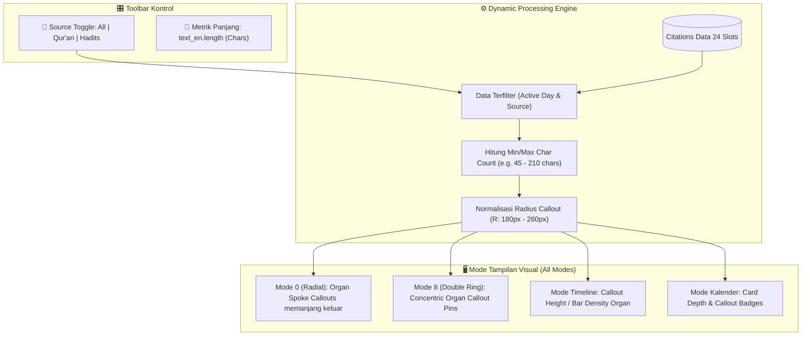

# Brief v05: Text-Length Organ Callouts & Scriptural Source Filtration Architecture

## 1. Executive Summary & Vision
Alih-alih menyajikan teks waktu statis yang umum diketahui orang (*"Pagi", "Siang", "Malam"*), antarmuka berevolusi menjadi **Organ Infografis Callout Dinamis berbasis Karakter Sitasi (Text-Length Organ Callout)**.

Tiap segmen sirkadian kini memancarkan **pita pin / organ stem callout** yang panjang radius atau tingginya merefleksikan densitas karakter teks terjemahan bahasa Inggris (`text_en.length`). Semakin kaya teks ayat/hadits tersebut, semakin menonjol ekstensi callout-nya seperti organ tubuh visual yang hidup.

Ditambah sistem **Filter Sumber Naskah Suci 3-Arah (Tri-State Scriptural Filter)**:
1. `ALL`: **Al-Qur'an & Hadits** (Default terpadu 8 fase sirkadian).
2. `QURAN_ONLY`: **Hanya Al-Qur'an** (Fokus pada kalam Ilahi).
3. `HADITH_ONLY`: **Hanya Hadits Nabawi** (Fokus pada tuntunan sunnah & atsar).

---

## 2. Diagram Interaksi & Alur Kerja (Mermaid)



---

## 3. Spesifikasi UI/UX Organ Callout Berdasarkan Mode

### 3.1. Mode 0: Radial Dial (Organ Spoke Callouts)
- **Konsep**: Daripada spoke garis statis biasa, tiap fase memiliki **pipette / organ callout**:
  - **Panjang Stem ($L$)**: Dihitung dari formula:
    $$R_{\text{callout}} = R_{\text{base}} + \left(\frac{\text{len} - \text{len}_{\min}}{\text{len}_{\max} - \text{len}_{\min}}\right) \times \Delta R$$
    *(di mana $R_{\text{base}} = 185\text{px}$, $\Delta R = 55\text{px}$).*
  - **Kepala Callout (Capsule Badge)**:
    - Chip kaca translusen melayang di ujung spoke.
    - Menampilkan: **Topik Intisari** + **Jumlah Karakter/Kata** (misal: `142 ch` atau `24 words`).
    - Tag jenis sumber: badge kecil `QUR'AN` (Cyan) atau `HADITS` (Emerald).
  - **Efek Organ**: Spoke memiliki garis tebal bergradasi dengan titik ujung bercahaya (*glowing organ node*).

### 3.2. Mode 8: Double Ring oo (2x12h Organ Pins)
- Pada cincin AM (00:00–12:00) dan PM (12:00–24:00), tiap node fase memancarkan callout pin keluar yang panjangnya proporsional dengan panjang teks naskah.

### 3.3. Mode Timeline (Pita Waktu 24 Jam)
- Tinggi bar atau ketebalan waveform pada trek audio/sitasi beradaptasi dinamis: segmen ayat yang panjang memiliki profil organ callout yang lebih tinggi dan berdenyut lembut saat aktif.

---

## 4. Spesifikasi Filter Naskah 3-Arah (Tri-State Filter)
Pill toggle modern di header kontrol instrumen visual:
- `[📖 Al-Qur'an & Hadits]` (All - 8 fase terisi penuh).
- `[📘 Al-Qur'an Saja]` (Fase hadits diredam dengan efek *hollow/ethereal* atau difilter, menyorot ayat Qur'ani).
- `[📗 Hadits Saja]` (Fase Qur'an diredam, menyorot hadits-hadits nabawi).

---

## 5. Algoritma Perhitungan Panjang Teks (Letter Count)
```javascript
function calculateCitationMetrics(citations) {
  return citations.map(c => {
    const text = c.text_en || "";
    const charCount = text.length;
    const wordCount = text.trim().split(/\s+/).length;
    return {
      ...c,
      charCount,
      wordCount,
      densityRank: 0 // dihitung terhadap min/max hari aktif
    };
  });
}
```

---

## 6. Keuntungan Estetika & Keilmuan
1. **Tidak Membosankan**: Pengguna tidak lagi melihat pengulangan label jam generik, melainkan lanskap data visual (*data physicalization*) dari kandungan naskah.
2. **Konteks Seketika**: Pengguna langsung tahu fase mana yang memiliki wejangan paling mendalam/panjang hanya dari lirikan mata (*glanceable depth*).
3. **Harmonisasi Bliss & Selective Glassmorphism**: Capsule callout tetap menggunakan *Selective Glassmorphism* berkontras tinggi sehingga teks tetap terbaca tajam di atas langit dan bukit Windows XP.
