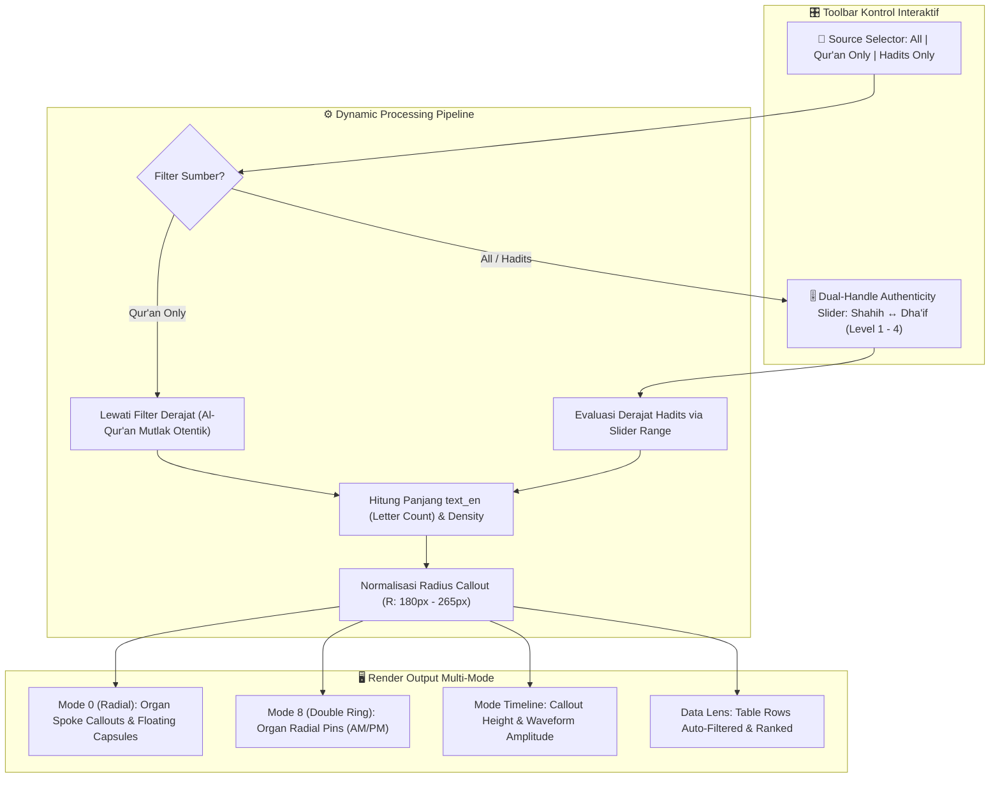

# Brief v06: Text-Length Organ Callouts & Hadith Authenticity Dual-Range Slider Architecture

## 1. Executive Summary & Vision
Aplikasi Muslim Citation Timeline bertransformasi dari sekadar dial penunjuk waktu statis menjadi **Instrumen Infografis Naskah Suci Interaktif**:
1. **Text-Length Organ Callout**: Juluran radial dan bar sirkadian yang panjangnya merefleksikan jumlah karakter bahasa Inggris (`text_en.length`), menciptakan profil organ infografis yang hidup dan berdenyut sesuai densitas teks.
2. **Tri-State Scriptural Source Filter**:
   - `ALL` : Al-Qur'an & Hadits Nabawi.
   - `QURAN_ONLY` : Hanya Al-Qur'an Al-Karim (Kalam Ilahi).
   - `HADITH_ONLY` : Hanya Hadits Nabawi (Tuntunan Sunnah).
3. **Dual-Handle Authenticity Slider (Shahih ↔ Dha'if)**:
   - Muncul secara dinamis saat mode Hadits aktif (mode `ALL` atau `HADITH_ONLY`).
   - Memungkinkan pengguna menyaring derajat hadits dari yang terkuat (*Muttafaqun 'Alayh / Sahih*) hingga yang berderajat *Hasan* atau *Dha'if*, memberikan kontrol akademik otentikasi hadits langsung di ujung jari pengguna.

---

## 2. Diagram Alur & Logika Filter (Mermaid)

---

## 3. Spesifikasi Dual-Handle Hadith Authenticity Slider

### 3.1. Skala Derajat Hadits (Levels 1 to 4)
Untuk menjembatani metodologi musthalah hadits ke dalam interaksi UI digital:
| Level | Kode | Nama Derajat | Definisi Akademik | Warna Indikator |
|---|---|---|---|---|
| **1** | `sahih_high` | **Shahih Tertinggi** | *Muttafaqun 'Alayh (Bukhari & Muslim)* | `#38bdf8` (Cyan Neon) |
| **2** | `sahih` | **Shahih** | *Shahih Bukhari / Muslim / Sunan* | `#22c55e` (Emerald) |
| **3** | `hasan` | **Hasan / Hasan Sahih** | Sanad tersambung, perawi adil dhabth sedang | `#eab308` (Gold Amber) |
| **4** | `dhaif` | **Dha'if (Lemah)** | Hadits dengan kelemahan sanad/matan | `#f43f5e` (Rose Coral) |

### 3.2. Kondisi Visibilitas Slider
- Saat pengguna memilih **`📘 Al-Qur'an Saja`**:
  - Slider otomatis **disembunyikan** (*fade out / collapse*) dengan catatan: *"Al-Qur'an bersifat qath'i al-wurud (otentik mutlak), filter derajat hadits nonaktif."*
- Saat pengguna memilih **`📖 Al-Qur'an & Hadits`** atau **`📗 Hadits Saja`**:
  - Slider otomatis **tampil mulus** (*slide down & fade in*) di sebelah kanan toggle filter.
  - Dua handle slider (*Min Grade* dan *Max Grade*) memungkinkan rentang bebas, misalnya:
    - `[Shahih — Shahih]` $\to$ Hanya hadits-hadits shahih tertinggi.
    - `[Shahih — Dha'if]` $\to$ Menampilkan seluruh spektrum hadits.

---

## 4. Spesifikasi Visual Organ Callout

### 4.1. Spoke Callout Radial (Mode 0)
- **Batang Organ (Stem)**: Garis spoke SVG dengan ketebalan dan panjang variabel:
  $$R_{\text{target}} = 180\text{px} + \left(\frac{\text{len} - \text{len}_{\min}}{\text{len}_{\max} - \text{len}_{\min}}\right) \times 65\text{px}$$
- **Ujung Organ (Floating Capsule Callout)**:
  - Badge kapsul semi-transparan melayang di ujung batang.
  - Memuat:
    1. **Ikon Sumber & Derajat**: 
       - Jika Qur'an: `📖 QS. Surah:Ayat`
       - Jika Hadits: `📗 HR. Bukhari [Shahih]`
    2. **Kutipan Intisari Topik**.
    3. **Meteran Karakter**: Chip kecil `142 ch` (jumlah karakter bahasa Inggris).
- **Efek Organ Diredam (*Filtered-Out Ghost*)**:
  - Segmen yang tidak memenuhi kriteria filter sumber atau derajat hadits ditampilkan dalam wujud *ethereal wireframe* (opasitas 12%, garis putus-putus), menunjukkan adanya fase waktu tapi naskahnya terfilter.

### 4.2. Mode 8: Double Ring oo
- Callout pins memancar konsentris keluar dari cincin AM dan PM dengan panjang proporsional terhadap karakter naskah.

### 4.3. Mode Timeline (Pita 24 Jam)
- Ketinggian blok klip dan amplifikasi waveform audio beradaptasi dengan panjang naskah: klip dengan naskah panjang tampak lebih dominan dan kaya.

---

## 5. Implementasi & Roadmap Perubahan File
1. **`index.html`**:
   - Menambahkan Tri-State Source Toggle: `Semua` | `Al-Qur'an` | `Hadits`.
   - Menambahkan Dual-Range Slider container untuk derajat Hadits (`#hadith-grade-slider-wrap`).
2. **`index.css`**:
   - Styling dual-handle range slider (glassmorphic track, glowing custom thumbs).
   - Styling organ callouts, capsule badges, dan status ethereal/ghost untuk segmen terfilter.
3. **`app.js`**:
   - Menambahkan state: `sourceFilter: 'all' | 'quran' | 'hadith'`, `hadithGradeMin: 1`, `hadithGradeMax: 4`.
   - Fungsi mapping derajat hadits (`getHadithGradeRank(citation)`).
   - Dynamic length calculator & normalization engine untuk spoke radial.
   - Sinkronisasi realtime ke Data Sheet tabel dan inspector drawer.
